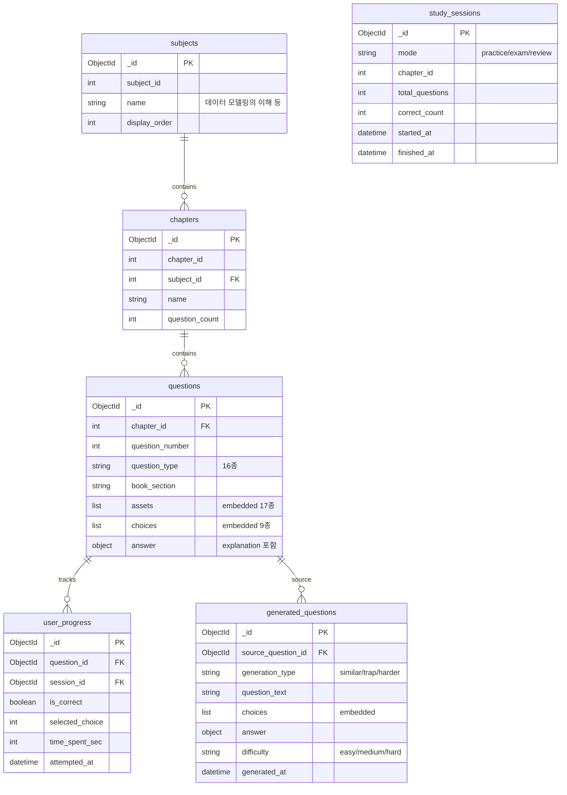

# SQLD 퀴즈 웹 — 프로젝트 설계 문서

---

## 1. 데이터 분석 결과

### 1.1 전체 규모
| 항목 | 수량 |
|------|------|
| 총 문제 수 | 297문제 |
| 챕터 수 | 12개 |
| 문제 유형 | 16종 |
| Asset 타입 | 17종 |
| 선택지 종류 | 9종 |
| 총 Asset 수 | 588개 |
| 총 선택지 수 | 1,188개 |

### 1.2 문제 유형 분포
```
best_choice          102건  ████████████████████ 34.3%
worst_choice         100건  ████████████████████ 33.7%
predict_result        24건  █████                 8.1%
fill_blank            18건  ████                  6.1%
fill_blanks_multi     10건  ██                    3.4%
identify_sql          10건  ██                    3.4%
different_result       8건  ██                    2.7%
derive_count           5건  █                     1.7%
identify_normal_form   4건  █                     1.3%
기타 7종              16건  ███                    5.4%
```

### 1.3 Asset 타입별 Payload 구조
```
text_block            349건  payload: { text }
sql_query              92건  payload: { code, dialect, sql }
data_table             64건  payload: { columns, name, rows, sub_kind }
list_items             16건  payload: { items }
sql_ddl                16건  payload: { code, dialect }
result_table           14건  payload: { columns, rows }
entity_schema          12건  payload: { entities[{table, columns}] }
erd                     7건  payload: (mermaid 문자열)
execution_plan          7건  payload: { text }
schema_variant_pair     2건  payload: { left{entities}, right{entities} }
sql_dml                 2건  payload: { code, dialect }
sql_trace               2건  payload: { headers, rows }
기타 5종                5건  (각 1건씩, 모두 다른 구조)
```

> **핵심 관찰**: 17종 asset이 각각 완전히 다른 payload 구조를 가짐.
> RDBMS로 정규화하면 테이블이 폭발적으로 늘어나거나 JSON 컬럼 의존이 불가피.
> → MongoDB 선택의 핵심 근거.

---

## 2. 기술 스택 결정 사항

### 2.1 전체 기술 스택

| 영역 | 기술 | 비고 |
|------|------|------|
| **Frontend** | React + Vite | SPA, 빠른 HMR |
| **스타일링** | TailwindCSS | 네이비 계열, 라이트 모드 전용 |
| **상태관리** | Zustand | 경량, 보일러플레이트 최소 |
| **라우팅** | React Router v6 | 표준, 안정적 |
| **차트** | Recharts | React 네이티브, 쉬운 API |
| **Backend** | FastAPI (Python) | 비동기, LangChain 동일 언어 |
| **DB** | MongoDB + Beanie (ODM) | 문서 기반, Pydantic 통합 |
| **AI/LLM** | LangChain + LLM API (추후 선택) | OpenAI / Claude 추상화 |
| **배포** | Vercel + Render + Atlas (무료) | 프론트/백엔드/DB 분리 |
| **인증** | 없음 | 1인 사용, 인증 불필요 |
| **언어** | 한국어 전용 | i18n 불필요 |
| **로컬 DB** | Docker Compose | 개발 중 MongoDB 컨테이너 |
| **Python 린터** | Ruff | 포맷+린트 통합 |
| **JS 린터** | ESLint + Prettier | 표준 조합 |
| **에러 표시** | react-hot-toast | 프론트 Toast 알림 |
| **LLM 재시도** | tenacity (3회) | 자동 재시도 |
| **테스트** | pytest + httpx | 필수 API만 |
| **로깅** | Python logging | console 출력 |
| **CI/CD** | GitHub Actions | 린트+테스트 자동화 |
| **Git** | main 단일 + 컨벤션 커밋 | feat:, fix:, docs: |
| **API 응답** | FastAPI 기본 | 200+data, 4xx/5xx+detail |

### 2.2 DB 프레임워크 선정 근거

#### 후보 비교

| 기준 | SQLModel + SQLite | **MongoDB + Beanie** | PostgreSQL + SQLAlchemy |
|------|:-:|:-:|:-:|
| JSON 유연성 | ◯ (JSON 컬럼) | **◎ (네이티브)** | ◯ (JSONB) |
| FastAPI 통합 | ◎ (Pydantic 공유) | **◎ (Pydantic 기반)** | △ (별도 스키마) |
| 학습 곡선 | ◎ 쉬움 | ◯ 보통 | △ 보통 |
| 설치 복잡도 | ◎ 제로 | ◯ Atlas 무료 | △ 서버 필요 |
| 분석 쿼리 | △ 제한적 | **◯ Aggregation** | ◎ SQL 완전 지원 |
| 비동기 지원 | △ 제한적 | **◎ Motor 네이티브** | ◯ asyncpg |

#### 결정: MongoDB + Beanie

1. **Impedance Mismatch 제로** — 17종 asset payload를 변환 없이 그대로 저장
2. **Pydantic 통합** — Beanie Document = Pydantic Model → FastAPI 응답 모델과 DB 모델 통합
3. **Single Query Loading** — 문제 1개 = document 1개 → JOIN 없이 한 번에 로드
4. **LangChain 출력 직접 저장** — AI 생성 결과(JSON)를 파싱 없이 바로 insert
5. **Atlas 무료 티어** — 512MB 스토리지, 이 프로젝트에 충분

### 2.3 배포 구성

```
┌─ Vercel (무료) ──────────────────────────────┐
│  React + Vite 빌드 → 정적 호스팅              │
│  환경변수: VITE_API_URL                       │
└──────────────────┬───────────────────────────┘
                   │ API 호출
┌──────────────────▼───────────────────────────┐
│  Render / Railway (무료 티어)                 │
│  FastAPI 서버                                │
│  환경변수: MONGODB_URI, LLM_API_KEY          │
└──────────────────┬───────────────────────────┘
                   │
┌──────────────────▼───────────────────────────┐
│  MongoDB Atlas (무료 M0)                     │
│  512MB / Shared Cluster                      │
│  DB: sqld_quiz                               │
└──────────────────────────────────────────────┘
```

> **참고**: Vercel은 정적 프론트엔드 호스팅에 적합하고, FastAPI 백엔드는
> Render 또는 Railway의 무료 티어를 활용합니다.
> 세 서비스 모두 무료 플랜으로 운영 가능합니다.

---

## 3. 시스템 아키텍처

### 3.1 전체 구조 (4계층)

```
┌──────────────────────────────────────────────────────┐
│  Frontend (React + Vite + TailwindCSS)               │
│  ┌──────────┐ ┌──────────┐ ┌────────┐ ┌──────────┐  │
│  │ Quiz UI  │ │Dashboard │ │ Review │ │ Settings │  │
│  │ 문제풀기  │ │ 학습현황  │ │ 오답노트│ │ 챕터선택  │  │
│  └──────────┘ └──────────┘ └────────┘ └──────────┘  │
│  상태: Zustand  |  차트: Recharts  |  라우팅: RRv6   │
└────────────────────┬─────────────────────────────────┘
                     │ REST API (JSON)
┌────────────────────▼─────────────────────────────────┐
│  Backend (FastAPI)                                    │
│                                                       │
│  ┌─ api/ (Router) ─────────────────────────────────┐ │
│  │ questions.py   generate.py    progress.py       │ │
│  │ GET /questions  POST /generate GET/POST /progress│ │
│  └──────┬──────────────┬──────────────┬────────────┘ │
│         │     DI       │     DI       │     DI       │
│  ┌──────▼──────────────▼──────────────▼────────────┐ │
│  │ services/                                        │ │
│  │ question_service  generator_service  progress_svc│ │
│  │ · 챕터별 조회      · 원본 로드       · 풀이 기록  │ │
│  │ · 랜덤 출제       · LangChain 호출   · 오답 목록  │ │
│  │ · 필터링/검색      · 결과 검증/저장   · 통계 집계  │ │
│  └──────┬──────────────┬──────────────┬────────────┘ │
│         │              │              │               │
│         │    ┌─────────▼────────────┐ │               │
│         │    │ langchain_module/    │ │               │
│         │    │ prompts → chains     │ │               │
│         │    │ → parser → generator │ │               │
│         │    └─────────┬───────────┘ │               │
│         │              │              │               │
│  ┌──────▼──────────────▼──────────────▼────────────┐ │
│  │ models/ (Beanie Documents = Pydantic Models)     │ │
│  │ Question │ UserProgress │ StudySession │ GenQ    │ │
│  └──────────────────────┬──────────────────────────┘ │
└─────────────────────────┼────────────────────────────┘
                          │
                ┌─────────▼──────────┐
                │  MongoDB Atlas     │
                │  (sqld_quiz DB)    │
                └────────────────────┘
```

### 3.2 백엔드 계층별 책임

```
┌─ api/ (Router Layer) ─────────────────────────────────────┐
│                                                            │
│  questions.py          generate.py         progress.py     │
│  GET  /questions       POST /generate      POST /progress  │
│  GET  /questions/:id   GET  /generated     GET  /progress  │
│  GET  /chapters                             GET  /wrong    │
│                                             GET  /stats    │
│  역할: HTTP 요청/응답, 입력 검증, 서비스 호출              │
└────────────────────────────────────────────────────────────┘
                          │ Depends()
┌─ services/ (Business Logic) ──────────────────────────────┐
│                                                            │
│  question_service      generator_service   progress_service│
│  · get_by_chapter()    · generate_variant() · record()     │
│  · get_random()        · get_cached()       · get_wrong()  │
│  · search()            · validate_output()  · get_stats()  │
│                                                            │
│  역할: 비즈니스 로직, 트랜잭션 관리, 서비스 간 조율        │
└────────────────────────────────────────────────────────────┘
                          │
┌─ langchain_module/ (AI Layer) ────────────────────────────┐
│                                                            │
│  prompts.py  →  chains.py  →  output_parsers.py          │
│       │              │               │                     │
│       └──────────────┼───────────────┘                     │
│                      ▼                                     │
│              question_generator.py                         │
│              · similar: 같은 개념, 다른 각도               │
│              · trap: 자주 틀리는 포인트 강조               │
│              · harder: 난이도 상향                         │
│                                                            │
│  역할: 프롬프트 구성, LLM 호출, 응답 파싱/검증            │
└────────────────────────────────────────────────────────────┘
                          │
┌─ models/ (Data Layer) ────────────────────────────────────┐
│                                                            │
│  Beanie Document Models (= Pydantic Models)               │
│                                                            │
│  Question        UserProgress      StudySession            │
│  GeneratedQ      Subject           Chapter                 │
│                                                            │
│  역할: DB 스키마 정의, CRUD 추상화, 인덱스 관리           │
└────────────────────────────────────────────────────────────┘
```

---

## 4. DB 스키마 (MongoDB Document 설계)

### 4.1 ERD (컬렉션 관계도)



### 4.2 Document 구조 상세

#### questions 컬렉션 (핵심 — 원본 JSON 구조 보존)
```json
{
  "_id": "ObjectId",
  "chapter_id": 1,
  "question_number": 7,
  "book_section": "I",
  "question_type": "worst_choice",

  "assets": [
    {
      "asset_type": "text_block",
      "payload": { "text": "ERD에 대한 설명으로 ..." }
    },
    {
      "asset_type": "erd",
      "payload": "erDiagram\n  고객 ||--o{ 주문 ..."
    },
    {
      "asset_type": "data_table",
      "payload": {
        "name": "주문상세",
        "columns": ["주문번호", "상품번호", "상품명"],
        "rows": [{"주문번호": 10001, "상품번호": 901, ...}]
      }
    }
  ],

  "choices": [
    {
      "choice_number": 1,
      "choice_kind": "text",
      "choice_text": "한 명의 고객은 ...",
      "is_correct": false
    },
    {
      "choice_number": 4,
      "choice_kind": "text",
      "choice_text": "하나의 주문은 ...",
      "is_correct": true
    }
  ],

  "answer": {
    "explanation": "주문 엔터티 입장에서는 ..."
  }
}
```

#### user_progress 컬렉션
```json
{
  "_id": "ObjectId",
  "question_id": "ObjectId (ref: questions)",
  "session_id": "ObjectId (ref: study_sessions)",
  "is_correct": false,
  "selected_choice": 2,
  "time_spent_sec": 45,
  "attempted_at": "2025-06-01T14:30:00Z"
}
```

#### generated_questions 컬렉션
```json
{
  "_id": "ObjectId",
  "source_question_id": "ObjectId (ref: questions)",
  "generation_type": "similar",
  "difficulty": "medium",
  "question_text": "정규화에 대한 설명으로 ...",
  "choices": [
    { "choice_number": 1, "choice_text": "...", "is_correct": false },
    { "choice_number": 2, "choice_text": "...", "is_correct": true },
    { "choice_number": 3, "choice_text": "...", "is_correct": false },
    { "choice_number": 4, "choice_text": "...", "is_correct": false }
  ],
  "answer": {
    "explanation": "...",
    "related_concept": "제3정규형"
  },
  "generated_at": "2025-06-01T15:00:00Z"
}
```

#### study_sessions 컬렉션
```json
{
  "_id": "ObjectId",
  "mode": "practice",
  "chapter_id": 3,
  "total_questions": 10,
  "correct_count": 7,
  "started_at": "2025-06-01T14:00:00Z",
  "finished_at": "2025-06-01T14:25:00Z"
}
```

### 4.3 인덱스 설계
```javascript
// questions — 챕터별 조회, 유형별 필터
db.questions.createIndex({ chapter_id: 1 })
db.questions.createIndex({ question_type: 1 })
db.questions.createIndex({ chapter_id: 1, question_number: 1 }, { unique: true })

// user_progress — 오답 조회, 세션별 조회
db.user_progress.createIndex({ question_id: 1 })
db.user_progress.createIndex({ session_id: 1 })
db.user_progress.createIndex({ is_correct: 1, question_id: 1 })

// generated_questions — 원본 문제별 조회
db.generated_questions.createIndex({ source_question_id: 1 })

// study_sessions — 최근 세션 조회
db.study_sessions.createIndex({ started_at: -1 })
db.study_sessions.createIndex({ mode: 1 })
```

---

## 5. 디렉토리 구조

```
sqld-quiz/
│
├── backend/
│   ├── main.py                    # FastAPI 앱 엔트리 + Beanie 초기화
│   ├── config.py                  # 환경변수 (MONGODB_URI, LLM_API_KEY)
│   ├── requirements.txt
│   │
│   ├── api/
│   │   ├── __init__.py
│   │   ├── questions.py           # 기존 문제 CRUD 라우터
│   │   ├── generate.py            # AI 변형 문제 생성 라우터
│   │   ├── progress.py            # 학습 기록/오답 관리 라우터
│   │   └── chapters.py            # 챕터/과목 목록 라우터
│   │
│   ├── models/
│   │   ├── __init__.py
│   │   ├── database.py            # Motor 클라이언트 + Beanie init
│   │   ├── question.py            # Question Document
│   │   ├── user_progress.py       # UserProgress Document
│   │   ├── study_session.py       # StudySession Document
│   │   └── generated_question.py  # GeneratedQuestion Document
│   │
│   ├── services/
│   │   ├── __init__.py
│   │   ├── question_service.py    # 문제 조회 비즈니스 로직
│   │   ├── progress_service.py    # 진도/오답 비즈니스 로직
│   │   └── generator_service.py   # AI 생성 오케스트레이션
│   │
│   ├── langchain_module/
│   │   ├── __init__.py
│   │   ├── prompts.py             # 프롬프트 템플릿
│   │   ├── chains.py              # LangChain 체인 구성
│   │   ├── output_parsers.py      # JSON 출력 파서
│   │   └── question_generator.py  # 변형 문제 생성 핵심 로직
│   │
│   ├── data/
│   │   ├── loader.py              # JSON → MongoDB 초기 로드 스크립트
│   │   └── questions/             # 12개 원본 JSON 파일
│   │       ├── 1__데이터_모델링의_이해.json
│   │       ├── 2__데이터_모델과_SQL.json
│   │       ├── 3__SQL_기본.json
│   │       ├── 4__SQL활용.json
│   │       ├── 5__관리구문.json
│   │       ├── 6__SQL_수행_구조.json
│   │       ├── 7__SQL_분석_도구.json
│   │       ├── 8__인덱스_튜닝.json
│   │       ├── 9__조인_튜닝.json
│   │       ├── 10__SQL_옵티마이저.json
│   │       ├── 11__고급_SQL_튜닝.json
│   │       └── 12__Lock과_트랜잭션_동시성_제어.json
│   │
│   └── tests/
│       ├── test_questions.py
│       ├── test_generator.py
│       └── test_progress.py
│
├── frontend/
│   ├── package.json
│   ├── vite.config.js
│   ├── tailwind.config.js
│   ├── index.html
│   │
│   ├── src/
│   │   ├── main.jsx
│   │   ├── App.jsx                # React Router 설정
│   │   │
│   │   ├── pages/
│   │   │   ├── HomePage.jsx           # 메인 대시보드
│   │   │   ├── QuizPage.jsx           # 문제 풀이
│   │   │   ├── ReviewPage.jsx         # 오답 노트
│   │   │   ├── ResultPage.jsx         # 결과/해설
│   │   │   └── ChapterSelectPage.jsx  # 챕터 선택
│   │   │
│   │   ├── components/
│   │   │   ├── quiz/
│   │   │   │   ├── QuestionCard.jsx       # 문제 카드 (원본/AI 공용)
│   │   │   │   ├── ChoiceList.jsx         # 선택지 목록 (9종 대응)
│   │   │   │   ├── AssetRenderer.jsx      # asset 분기 렌더링 (17종)
│   │   │   │   ├── SqlCodeBlock.jsx       # SQL 코드 하이라이팅
│   │   │   │   ├── DataTableView.jsx      # data_table 렌더링
│   │   │   │   ├── ErdDiagram.jsx         # ERD (mermaid) 렌더링
│   │   │   │   ├── ExplanationPanel.jsx   # 해설 패널
│   │   │   │   ├── QuizTimer.jsx          # 타이머
│   │   │   │   └── ProgressBar.jsx        # 진행률 바
│   │   │   │
│   │   │   ├── dashboard/
│   │   │   │   ├── StatsOverview.jsx      # 전체 통계 (Recharts)
│   │   │   │   ├── ChapterProgress.jsx    # 챕터별 진도
│   │   │   │   ├── WeakPointChart.jsx     # 취약 분야 차트
│   │   │   │   └── StudyStreak.jsx        # 학습 연속일
│   │   │   │
│   │   │   └── common/
│   │   │       ├── Header.jsx
│   │   │       ├── Sidebar.jsx
│   │   │       ├── Badge.jsx
│   │   │       └── Modal.jsx
│   │   │
│   │   ├── stores/
│   │   │   ├── quizStore.js           # Zustand: 퀴즈 상태
│   │   │   └── progressStore.js       # Zustand: 진도 상태
│   │   │
│   │   ├── hooks/
│   │   │   ├── useQuiz.js
│   │   │   └── useProgress.js
│   │   │
│   │   ├── api/
│   │   │   ├── client.js              # Axios 인스턴스
│   │   │   ├── questionApi.js
│   │   │   ├── generateApi.js
│   │   │   └── progressApi.js
│   │   │
│   │   └── utils/
│   │       ├── questionTypes.js       # 16종 문제 유형 매핑
│   │       └── assetRenderers.js      # 17종 asset 렌더링 유틸
│   │
│   └── public/
│       └── favicon.ico
│
├── docker-compose.yml             # 로컬 개발: MongoDB + Backend
├── .env.example                   # 환경변수 템플릿
├── .gitignore
└── README.md
```

---

## 6. 핵심 데이터 흐름

### Mode 1: 기존 문제 풀기 (7단계)
```
[사용자] 챕터 선택
    │
    ▼
[Router] GET /api/questions?chapter_id=3&count=10
    │
    ▼
[Service] question_service.get_random_questions()
    │
    ▼
[MongoDB] db.questions.aggregate([
            { $match: { chapter_id: 3 } },
            { $sample: { size: 10 } }
          ])
    │  → 문제 + choices + assets 한 번에 로드 (JOIN 없음)
    ▼
[사용자] 문제 풀기 → 정답/오답 판정
    │
    ▼
[Router] POST /api/progress
    │
    ▼
[결과] 해설 표시 + 기록 저장
```

### Mode 2: AI 변형 문제 (9단계)
```
[사용자] "오답 복습" 선택
    │
    ▼
[Router] GET /api/progress/wrong
    │  → 틀린 문제 ID 목록 반환
    ▼
[Router] POST /api/generate { source_id, type: "similar" }
    │
    ▼
[Service] generator_service.generate_variant()
    │  → 원본 문제 document 로드 (문제 + 해설 + 선택지)
    ▼
[LangChain] question_generator.generate()
    │  prompts.py  → 원본 컨텍스트 + 생성 지시
    │  chains.py   → LLM API 호출
    │  parsers.py  → JSON 구조화
    ▼
[MongoDB] generated_questions 컬렉션에 저장 (캐싱)
    │
    ▼
[사용자] 변형 문제 풀기 (동일한 QuestionCard 컴포넌트)
    │
    ▼
[Router] POST /api/progress { gen_question_id }
    │
    ▼
[결과] 해설 + 원본 문제와의 차이점 설명
```

---

## 7. LangChain 변형 문제 생성 전략

### 7.1 LLM 추상화 (추후 선택 대응)

```python
# langchain_module/chains.py
from langchain.chat_models import init_chat_model

def get_llm():
    """환경변수에 따라 OpenAI 또는 Claude 자동 선택"""
    provider = os.getenv("LLM_PROVIDER", "openai")  # openai | anthropic
    model = os.getenv("LLM_MODEL", "gpt-4o")

    return init_chat_model(
        model=model,
        model_provider=provider,
        temperature=0.7,
    )
```

> LangChain의 `init_chat_model`을 사용하면 provider만 바꿔도
> OpenAI ↔ Claude 전환이 가능합니다. 추후 LLM을 결정하면
> `.env` 파일만 수정하면 됩니다.

### 7.2 생성 유형 3가지

| 유형 | 설명 | 예시 |
|------|------|------|
| similar | 같은 개념을 다른 각도에서 질문 | 원본: "정규화 목적?" → 변형: "제3정규형 조건?" |
| trap | 자주 틀리는 포인트를 강조 | 오답 패턴 분석 → 미묘한 차이 질문 |
| harder | 같은 주제의 난이도 상향 | 단순 정의 → 복합 조건 시나리오 |

### 7.3 LLM 출력 포맷
```json
{
  "question_text": "생성된 문제 텍스트",
  "question_type": "best_choice",
  "choices": [
    { "choice_number": 1, "choice_text": "...", "is_correct": false },
    { "choice_number": 2, "choice_text": "...", "is_correct": true },
    { "choice_number": 3, "choice_text": "...", "is_correct": false },
    { "choice_number": 4, "choice_text": "...", "is_correct": false }
  ],
  "answer": {
    "explanation": "정답 해설",
    "related_concept": "제3정규형"
  },
  "difficulty": "medium"
}
```

---

## 8. 환경변수

### .env.example
```env
# MongoDB
MONGODB_URI=mongodb+srv://<user>:<pass>@cluster.mongodb.net/sqld_quiz

# LLM (추후 선택)
LLM_PROVIDER=openai          # openai | anthropic
LLM_MODEL=gpt-4o             # gpt-4o | claude-sonnet-4-20250514
LLM_API_KEY=sk-...

# Backend
BACKEND_PORT=8000
CORS_ORIGINS=http://localhost:5173

# Frontend (Vite)
VITE_API_URL=http://localhost:8000/api
```

---

## 9. 핵심 의존성

### backend/requirements.txt
```
fastapi>=0.110
uvicorn[standard]>=0.29
motor>=3.4                    # MongoDB 비동기 드라이버
beanie>=1.26                  # Pydantic 기반 MongoDB ODM
langchain>=0.2
langchain-openai>=0.1         # OpenAI 지원
langchain-anthropic>=0.1      # Claude 지원
pydantic>=2.7
python-dotenv>=1.0
```

### frontend/package.json (핵심 의존성)
```json
{
  "dependencies": {
    "react": "^18.3",
    "react-dom": "^18.3",
    "react-router-dom": "^6.23",
    "zustand": "^4.5",
    "recharts": "^2.12",
    "axios": "^1.7",
    "react-syntax-highlighter": "^15.5"
  },
  "devDependencies": {
    "@vitejs/plugin-react": "^4.3",
    "vite": "^5.4",
    "tailwindcss": "^3.4",
    "autoprefixer": "^10.4",
    "postcss": "^8.4"
  }
}
```

---

## 10. 개발 로드맵

### Phase 1: 기본 뼈대 (기존 문제 풀기)
- [ ] MongoDB Atlas 클러스터 생성 + 연결 설정
- [ ] Beanie Document 모델 정의
- [ ] JSON → MongoDB 로더 구현 (`data/loader.py`)
- [ ] FastAPI 라우터/서비스 기본 구조
- [ ] React 프론트: 챕터 선택 → 문제 풀기 → 결과 플로우
- [ ] 17종 asset 렌더러 구현 (`AssetRenderer` 분기)
- [ ] 9종 choice 렌더러 구현

### Phase 2: 학습 기록 시스템
- [ ] 풀이 기록 저장/조회 API
- [ ] 오답 노트 기능
- [ ] 세션별 결과 집계
- [ ] 챕터별 정답률 대시보드 (Recharts)

### Phase 3: AI 변형 문제 생성
- [ ] LLM 선택 및 API 키 설정
- [ ] LangChain 프롬프트 설계 (3종 생성 유형)
- [ ] Output Parser + 품질 검증 로직
- [ ] 생성 문제 캐싱 (동일 원본 → 재사용)
- [ ] 오답 기반 자동 추천

### Phase 4: 고도화 + 배포
- [ ] 취약 분야 자동 분석 (MongoDB Aggregation)
- [ ] 모의고사 모드 (시간 제한 + 챕터 혼합 출제)
- [ ] Vercel 프론트 배포
- [ ] Render/Railway 백엔드 배포
- [ ] 도메인 연결 및 CORS 설정